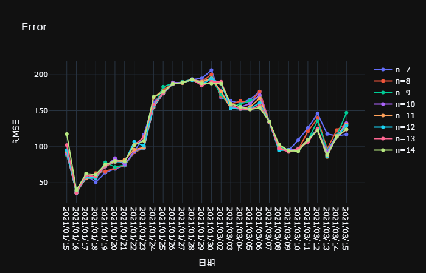
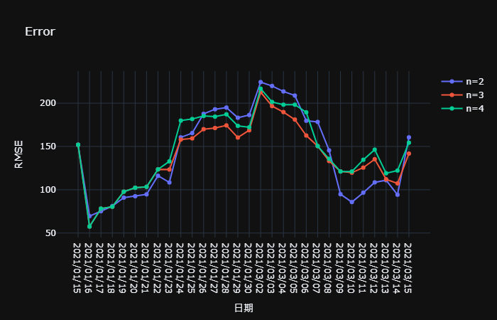

**最後更新日期: 2021-03-22**

以下是我在 jupyter notebook 的分析過程，由於 markdown 的限制，並沒有把所有 output 都記錄在此份 README.md

**懶人包**: 我的作法並沒有用到 ML ，而是觀察之後自己造一個公式去估算，原因是:
1. 看不出備載容量跟其他屬性有任何高度相關
2. 預測的區間小，沒辦法利用大趨勢預測
3. 每年 3 月備載容量的 pattern 長的不一樣，直接餵給常用的 model 感覺誤差會很大 (雖然我沒有嘗試過)

可能我太廢了，不知道怎麼分析以及套用適合的 ML 模型，希望可以觀摩助教或其他同學如何用機器學習來做這一題

## 引入函式庫

```python
import pandas as pd

# --- plotly ---
import plotly.graph_objs as go
import plotly.express as px
import plotly.io as pio
import datetime
pio.templates.default = "plotly_dark"
```

## 取得原始資料
- 讀取[台灣電力公司_過去電力供需資訊](https://data.gov.tw/dataset/19995)作為 `df1` 
    - 區間: 2019/01/01 ~ 2021/01/31
    - 包含 “日期”、”尖峰負載(MW)”、”備轉容量(MW)”, “備轉容量率(%)”...
    - ”備轉容量(MW)” (operating reserve) 是預測的目標

- 讀取[台灣電力公司_本年度每日尖峰備轉容量率](https://data.gov.tw/dataset/25850)作為 `df2`
    - 區間: 2020/01/01 ~ 2020/12/25
    - 包含 “日期”、”備轉容量(萬瓩)”、“備轉容量率(%)”
    - 1 萬瓩 = 10 MW

查看 `df1` 的所有欄位

```python
df1 = pd.read_csv('1.csv')
df2 = pd.read_csv('2.csv')
df1.columns
```

其中只關注全局的資訊，把個別發電廠的欄位都捨棄，將`工業用電`和`民生用電`相加儲存到 `總用電(百萬度)` ，並且將日期變為 `datetime`

```python
df1 = df1[['日期', '淨尖峰供電能力(MW)', '尖峰負載(MW)', '備轉容量(MW)', '備轉容量率(%)']]
tmp = []
for i in df1.index:
    tmp.append(datetime.datetime.strptime(str(df1.loc[i, '日期']), '%Y%m%d'))
df1['日期2'] = tmp
df1
```

---

用 plotly 畫出淨尖峰供電能力(MW), 尖峰負載(MW),備轉容量(MW) 的折線圖

```python
fig = px.line(df1, x='日期2', y=['淨尖峰供電能力(MW)', '尖峰負載(MW)','備轉容量(MW)'], title='備轉容量')
fig.update_layout(title='供電、負載、備轉', xaxis_title='日期', yaxis_title='功率 (MW)')
fig.show()
```


可以發現 2019 年 4 月份的 `備轉容量(MW)` 的數值很奇怪，跟其他時間相比特別低，這裡我透過 excel 開啟檔案，透過觀察發現:  
>備轉容量(MW) = 淨尖峰供電能力(MW) - 尖峰負載(MW)

---

以下，我們將 `備轉容量(MW)` 重新計算，取代錯誤的值，然後再次觀察圖表

```python
tmp = []
for i in df1.index:
    tmp.append(df1.loc[i, '淨尖峰供電能力(MW)'] - df1.loc[i, '尖峰負載(MW)'])
df1['備轉容量(MW)'] = tmp
fig = px.line(df1, x='日期2', y=['淨尖峰供電能力(MW)', '尖峰負載(MW)','備轉容量(MW)'])
fig.update_layout(title='供電、負載、備轉', xaxis_title='日期', yaxis_title='功率 (MW)')
fig.show()
```


- 由上圖可以發現天氣越炎熱用電量越高，但是備載容量增加的沒那麼明顯  
- 供用電呈現密集的震盪，我初步猜測震盪的高峰代表平日，低谷代表假日

---

我在下兩張圖將每個日期用圓點標示，觀察平日和假日用電的差異，並且我只擷取 3 至 4 月觀察，我認為其他月份的 pattern 參考意義不大

```python
# begin day and end day
begin = 59
end = 119

fig = go.Figure()
fig.add_trace(go.Scatter(x=df1['日期2'][begin:end], y=df1['淨尖峰供電能力(MW)'][begin:end], mode='lines+markers', name='淨尖峰供電能力(MW)'))
fig.add_trace(go.Scatter(x=df1['日期2'][begin:end], y=df1['尖峰負載(MW)'][begin:end], mode='lines+markers', name='尖峰負載(MW)'))
fig.add_trace(go.Scatter(x=df1['日期2'][begin:end], y=df1['備轉容量(MW)'][begin:end], mode='lines+markers', name='備轉容量(MW)'))
title_str = '供電用電狀況 (' + str(df1['日期2'][begin]) + ' - ' + str(df1['日期'][end]) + ')'
fig.update_layout(title=title_str, xaxis_title='日期', yaxis_title='功率 (MW)')
fig.show()
```


```python
# begin day and end day
begin = 425
end = 485

fig = go.Figure()
fig.add_trace(go.Scatter(x=df1['日期2'][begin:end], y=df1['淨尖峰供電能力(MW)'][begin:end], mode='lines+markers', name='淨尖峰供電能力(MW)'))
fig.add_trace(go.Scatter(x=df1['日期2'][begin:end], y=df1['尖峰負載(MW)'][begin:end], mode='lines+markers', name='尖峰負載(MW)'))
fig.add_trace(go.Scatter(x=df1['日期2'][begin:end], y=df1['備轉容量(MW)'][begin:end], mode='lines+markers', name='備轉容量(MW)'))
title_str = '供電用電狀況 (' + str(df1['日期2'][begin]) + ' - ' + str(df1['日期'][end]) + ')'
fig.update_layout(title=title_str, xaxis_title='日期', yaxis_title='功率 (MW)')
fig.show()
```


- 由上圖可以發現震盪的波峰通常都維持 5 天，對照日曆也確定是週一到五，而低谷則是星期六日和國定假日
- 備載容量卻沒有明顯的波峰波谷，而且通常備載容量通常在比前幾日高出許多後又會降回來
- 一樣，備載容量有時在假日時會增加，但沒那麼規律，基本上可以視為與尖峰負載無關

>由此我得出一個結論: 備載容量在假日時有機會微幅提升，但大部分時候是穩定的

---

接下來我新增一個欄位，將資料標記星期一至星期天 (1 ~ 7)

```python
day = 2
tmp = []
for i in df1.index:
    tmp.append(day)
    if day == 7:
        day = 1
    else:
        day = day + 1
df1['星期'] = tmp

day = 5
tmp = []
for i in df2.index:
    tmp.append(day)
    if day == 7:
        day = 1
    else:
        day = day + 1
df2['星期'] = tmp
```

再看看 `df2` (台灣電力公司_本年度每日尖峰備轉容量率) 的資料，先把備轉容量單位換成 MW

```python
df2['備轉容量(MW)'] = df2['備轉容量(萬瓩)'] * 10
tmp = []
for i in df2.index:
    tmp.append(datetime.datetime.strptime(str(df2.loc[i, '日期']), '%Y/%m/%d'))
df2['日期2'] = tmp
df2
```

2/27, 2/28, 2/29 是國定連假，會造成雜訊，故先把這三天 drop 掉

```python
tmp = 0
while True:
    if df2['日期'][tmp] == '2021/02/27':
        break
    else:
        tmp = tmp + 1
df2 = df2.drop([tmp, tmp+1, tmp+2])
df2 = df2.reset_index(drop=True)
```

---

## 用前 n 日平均和 moving average 分析

觀察每日往前回推 4、7、14 日的均線

```
def avg_line(n):
    lst = []
    for i in range(n, len(df2)):
        lst.append(sum(df2[i - n:i]['備轉容量(MW)'].tolist()) / n)
    return lst
    
fig = go.Figure()
fig.add_trace(go.Scatter(x=df2['日期2'], y=df2['備轉容量(MW)'], mode='lines+markers', name='備轉容量(MW)'))
#fig.add_trace(go.Scatter(x=df2['日期2'][14:], y=avg_line(14), mode='lines', name = '14 日均線'))
fig.add_trace(go.Scatter(x=df2['日期2'][14:], y=avg_line(14), name='14 日均線', line = dict(dash='dash')))
fig.add_trace(go.Scatter(x=df2['日期2'][7:], y=avg_line(7), name = '7 日均線', line = dict(color='yellow', dash='dash')))
fig.add_trace(go.Scatter(x=df2['日期2'][4:], y=avg_line(4), name = '4 日均線', line = dict(color='green', dash='dash')))
title_str = '備轉容量 2021'
fig.update_layout(title=title_str, xaxis_title='日期', yaxis_title='功率 (MW)')
fig.show()
```


觀察 3、5、7 日的 moving averages

```python
def avg_line(n):
    lst = []
    for i in range(n, len(df2)):
        lst.append(sum(df2[i - n:i]['備轉容量(MW)'].tolist()) / n)
    return lst

fig = go.Figure()
fig.add_trace(go.Scatter(x=df2['日期2'], y=df2['備轉容量(MW)'], mode='lines+markers', name='備轉容量(MW)'))
fig.add_trace(go.Scatter(x=df2['日期2'][1:], y=avg_line(3), name='3-period MA', line = dict(dash='dash')))
fig.add_trace(go.Scatter(x=df2['日期2'][2:], y=avg_line(5), name='5-period MA', line = dict(dash='dash')))
fig.add_trace(go.Scatter(x=df2['日期2'][3:], y=avg_line(7), name='7-period MA', line = dict(color='yellow', dash='dash')))
```


由均線圖和 moving averages 圖可以發現 moving averages 的趨勢要比前 n 日平均更準，不知道有沒有機會拿這兩樣資訊來預測

---

## 用星期1~7分析

觀察每個星期一的備轉容量，`list_by_day` 可以觀看每周 x 的備轉容量， x 介於 1 至 7

```python
def list_by_day(df, x):
    date = []
    lst = []
    for i in range(0, len(df)):
        if df['星期'][i] == x:
            date.append(df['日期'][i])
            lst.append(df['備轉容量(MW)'][i])
    print(date)
    print(lst)
```

先觀察每周一的備轉容量

```python
list_by_day(df2, 1)
```
```
['2021/01/04', '2021/01/11', '2021/01/18', '2021/01/25', '2021/02/01', '2021/02/08', '2021/02/15', '2021/02/22', '2021/03/08', '2021/03/15']
[3032.0, 3093.0, 3157.0, 3269.0, 2938.0, 3047.0, 2645.0, 2989.0, 3110.0, 3074.0]
```

可以發現除了國定假日 2/15 (農曆新年)和 3/1 (二二八)之外，星期一的備轉容量都介於 2900 和 3200 之間，而且 3/8 和 3/15 分別為 3110 和 3074 ，再考慮之後天氣不會變冷，我認為 3/22 的備轉容量有很大的機率落在 3100 上下

接下來用相同的方法分析其他星期:

```python
list_by_day(df2, 2)
```
```
['2021/01/05', '2021/01/12', '2021/01/19', '2021/01/26', '2021/02/02', '2021/02/09', '2021/02/16', '2021/02/23', '2021/03/02', '2021/03/09', '2021/03/16']
[3067.0, 3116.0, 3159.0, 3219.0, 3045.0, 2880.0, 3002.0, 3109.0, 3221.0, 3048.0, 3087.0]
```
```python
list_by_day(df2, 3)
```
```
['2021/01/06', '2021/01/13', '2021/01/20', '2021/01/27', '2021/02/03', '2021/02/10', '2021/02/17', '2021/02/24', '2021/03/03', '2021/03/10', '2021/03/17']
[3102.0, 3114.0, 3149.0, 3064.0, 3006.0, 2888.0, 2824.0, 3049.0, 3075.0, 3055.0, 3183.0]
```
```python
list_by_day(df2, 4)
```
```
['2021/01/07', '2021/01/14', '2021/01/21', '2021/01/28', '2021/02/04', '2021/02/11', '2021/02/18', '2021/02/25', '2021/03/04', '2021/03/11', '2021/03/18']
[3102.0, 3132.0, 3074.0, 3286.0, 3132.0, 2833.0, 2907.0, 3029.0, 3088.0, 3077.0, 3214.0]
```
```python
list_by_day(df2, 5)
```
```
['2021/01/01', '2021/01/08', '2021/01/15', '2021/01/22', '2021/01/29', '2021/02/05', '2021/02/12', '2021/02/19', '2021/02/26', '2021/03/05', '2021/03/12', '2021/03/19']
[2767.0, 3105.0, 3310.0, 3097.0, 3203.0, 3060.0, 2992.0, 2885.0, 3041.0, 3268.0, 3272.0, 3137.0]
```
```python
list_by_day(df2, 6)
```
```
['2021/01/02', '2021/01/09', '2021/01/16', '2021/01/23', '2021/01/30', '2021/02/06', '2021/02/13', '2021/02/20', '2021/03/06', '2021/03/13', '2021/03/20']
[2936.0, 3202.0, 3046.0, 3203.0, 3447.0, 3066.0, 3024.0, 2975.0, 2805.0, 3075.0, 2839.0]
```
```python
list_by_day(df2, 7)
```
```
['2021/01/03', '2021/01/10', '2021/01/17', '2021/01/24', '2021/01/31', '2021/02/07', '2021/02/14', '2021/02/21', '2021/03/07', '2021/03/14', '2021/03/21']
[3037.0, 2906.0, 3035.0, 3073.0, 2906.0, 2763.0, 2911.0, 3139.0, 2752.0, 2933.0, 3186.0]
```

> 總結: 預測時應該會從 n 日平均或星期來下手，不考慮使用 ML 模型，因為備轉容量似乎跟供電、負載無關，而且只預測 7 天，不能依靠大趨勢，參考前兩個禮拜內的資料或同為星期 x 的資料應該比較準

---

## 準備預測

因為備載容量找不到甚麼相關度較高的屬性，所以我決定先用前 n 天的平均來做為我預測的值，例如: 若 n = 5 且預測目標是 3/23 ，我就拿 3/18 至 3/22 的備載容量拿來平均，作為預測的值

```python
from sklearn.metrics import mean_squared_error
from math import sqrt
```

首先我定義 `orig_data` 回傳以 `begin_date` 為基準取得 `interval` 天的備載容量  
例如: `orig_data('2021/03/10', 3)` 即為取得 2021/3/10 到 2021/3/12 這三天的備載容量

```python
def orig_data(begin_date, interval):
    tmp = 0
    for i in df2.index:
        if df2.loc[i, '日期'] == begin_date:
            break
        else:
            tmp = tmp + 1
    return df2[tmp: tmp + interval]['備轉容量(MW)'].tolist()
```

為了避開農曆新年，我只用以下日期來測試

```python
test_lst = []
tmp_str = '2021/01/'
for i in range(15, 31):
    test_lst.append(tmp_str + str(i))
tmp_str = '2021/03/0'
for i in range(2, 10):
    test_lst.append(tmp_str + str(i))
tmp_str = '2021/03/'
for i in range(10, 16):
    test_lst.append(tmp_str + str(i))
print(test_lst)
```
```
['2021/01/15', '2021/01/16', '2021/01/17', '2021/01/18', '2021/01/19', '2021/01/20', '2021/01/21', '2021/01/22', '2021/01/23', '2021/01/24', '2021/01/25', '2021/01/26', '2021/01/27', '2021/01/28', '2021/01/29', '2021/01/30', '2021/03/02', '2021/03/03', '2021/03/04', '2021/03/05', '2021/03/06', '2021/03/07', '2021/03/08', '2021/03/09', '2021/03/10', '2021/03/11', '2021/03/12', '2021/03/13', '2021/03/14', '2021/03/15']
```

---

## 用前 n 日平均預測

定義 `model1` 作為**前 n 日平均**的預測函數，以 `begin_date` 為基準預測 `interval` 天的備載容量，用 `n` 天前的資料平均，再針對假日做一些調整

```python
def model1(begin_date, interval, n):
    tmp = 0
    for i in df2.index:
        if df2.loc[i, '日期'] == begin_date:
            break
        else:
            tmp = tmp + 1
    lst = df2[tmp - n:tmp]['備轉容量(MW)'].tolist()
    ret = []
    mean = sum(lst) / n
    for i in range(0, interval):
        ret.append(int(mean))
    return ret
```

`evaluate` 和 `print_evaluate` 是使用 Root Mean Squared Error (RMSE) 計算 `model1` 模型的誤差

```python
def evaluate(begin_date, interval, n):
    pred = model1(begin_date, interval, n)
    actual = orig_data(begin_date, interval)
    return sqrt(mean_squared_error(actual, pred))

def print_evaluate(begin_date, interval, n):
    pred = model1(begin_date, interval, n)
    actual = orig_data(begin_date, interval)
    rtms = sqrt(mean_squared_error(actual, pred))
    print('from:', begin_date, 'interval:', interval, 'days',)
    print('actual data:', actual)
    print('pred data:  ', pred)
    print('RTMS error:', rtms)
```

以下舉一個例子，假設預測 03/15 往後的 7 天 (含 03/11)，取往前 13 天的平均，所計算出的 RMSE

```python
print_evaluate('2021/03/15', 7, 13)
```
```
from: 2021/03/15 interval: 7 days
actual data: [3074.0, 3087.0, 3183.0, 3214.0, 3137.0, 2839.0, 3186.0]
pred data:   [3059, 3059, 3059, 3059, 3059, 3059, 3059]
RTMS error: 125.93819345785683
```

接下來我檢視單純計算 7 至 14 日均線 (即 `model1`) 預測後 7 日的 RMSE。

舉例來說， x 軸座標為 2021/03/10 ，對應到 n = 10 的折線的 y 座標，其 y 值即為對前 10 天備載容量平均，對後 7 天套用這個平均值所算出的 RMSE

```python
n1, n2 = 7, 15
# test
result = []
for i in range(n1, n2):
    tmp = []
    for j in range(0, len(test_lst)):
        tmp.append(evaluate(test_lst[j], 7, i))
    result.append(tmp)

# show errors
fig = go.Figure()
for i in range(0, n2 - n1):
    fig.add_trace(go.Scatter(x=test_lst, y=result[i], mode='lines+markers', name='n=' + str(n1 + i)))
fig.update_layout(title='Error', xaxis_title='日期', yaxis_title='RMSE')
fig.show()
```


- 由於星期一的備載容量通常較高，所以將預測的星期一的備轉容量拉高 30
- 由於星期六日通常是該周備轉容量最低的，所以將預測的星期日的備轉容量拉低 30
(數字 30 是我憑感覺亂選的，也許可以用暴力法挑出最優的數字，但有 overfitting 的疑慮)

```python
def model1(begin_date, interval, n):
    tmp = 0
    day = 0
    for i in df2.index:
        if df2.loc[i, '日期'] == begin_date:
            day = df2['星期'][i]
            break
        else:
            tmp = tmp + 1
    lst = df2[tmp - n:tmp]['備轉容量(MW)'].tolist()
    ret = []
    days = []
    mean = sum(lst) / n
    for i in range(0, interval):
        temp = int(mean)

        # ---
        if day == 1:
            temp = temp + 30
        elif day == 6 or day == 7:
            temp = temp - 30
        ret.append(temp)
        # ---

        if day == 7:
            day = 1
        else:
            day = day + 1
    
    return ret

print_evaluate('2021/03/15', 7, 13)
```
```
from: 2021/03/15 interval: 7 days
actual data: [3074.0, 3087.0, 3183.0, 3214.0, 3137.0, 2839.0, 3186.0]
pred data:   [3089, 3059, 3059, 3059, 3059, 3029, 3029]
RTMS error: 123.77571882816343
```
```python
n1, n2 = 7, 15
# test
result = []
for i in range(n1, n2):
    tmp = []
    for j in range(0, len(test_lst)):
        tmp.append(evaluate(test_lst[j], 7, i))
    result.append(tmp)

# show errors
fig = go.Figure()
for i in range(0, n2 - n1):
    fig.add_trace(go.Scatter(x=test_lst, y=result[i], mode='lines+markers', name='n=' + str(n1 + i)))
fig.update_layout(title='Error', xaxis_title='日期', yaxis_title='RMSE')
fig.show()
```



經過微調後，3月份預測的 RMSE 幾乎沒變...

---

## 用星期 x 預測

簡單來說酒是取同為星期 x 的備載容量來平均，例如: 預測 03/11 的備載容量，則拿同為星期四的 03/04、02/25、02/18 來平均。至於二二八連假這種被 drop 掉的，則會再往前取一個禮拜的資料來替代。

```python
def list_by_day2(df, end, day):
    lst = []
    for i in range(end):
        if df['星期'][i] == day:
            lst.append(df['備轉容量(MW)'][i])
    return lst

def model2(begin_date, interval, n):
    tmp = 0
    day = 0
    for i in df2.index:
        if df2.loc[i, '日期'] == begin_date:
            day = df2.loc[i, '星期']
            break
        else:
            tmp = tmp + 1
    ret = []
    for i in range(0, interval):
        mean = 0
        div = 0
        lst = list_by_day2(df2, tmp + i, day)
        lst.reverse()
        if n > len(lst):
            mean = sum(lst) / len(lst)
        else:
            mean = sum(lst[0:n]) / n
        ret.append(int(mean))
        if day == 7:
            day = 1
        else:
            day = day + 1
    return ret
```
```python
def evaluate(begin_date, interval, n):
    pred = model2(begin_date, interval, n)
    actual = orig_data(begin_date, interval)
    return sqrt(mean_squared_error(actual, pred))

def print_evaluate(begin_date, interval, n):
    pred = model2(begin_date, interval, n)
    actual = orig_data(begin_date, interval)
    rtms = sqrt(mean_squared_error(actual, pred))
    print('from:', begin_date, 'interval:', interval, 'days',)
    print('actual data:', actual)
    print('pred data:  ', pred)
    print('RTMS error:', rtms)
```

假設預測 03/14 往後的 7 天 (含 03/14)，對於 03/14 取往前 3 周同為周一的平均 (03/07、(跳過 02/28)、02/21、02/14)，03/15 依此類推，所計算出的 RMSE

```python
print_evaluate('2021/03/14', 7, 3)
```
```
from: 2021/03/14 interval: 7 days
actual data: [2933.0, 3074.0, 3087.0, 3183.0, 3214.0, 3137.0, 2839.0]
pred data:   [2934, 2914, 3126, 3059, 3064, 3193, 2951]
RTMS error: 107.35654880550403
```
```python
n1, n2 = 2, 5
# test
result = []
for i in range(n1, n2):
    tmp = []
    for j in range(0, len(test_lst)):
        tmp.append(evaluate(test_lst[j], 7, i))
    result.append(tmp)

# show errors
fig = go.Figure()
for i in range(0, n2 - n1):
    fig.add_trace(go.Scatter(x=test_lst, y=result[i], mode='lines+markers', name='n=' + str(n1 + i)))
fig.update_layout(title='Error', xaxis_title='日期', yaxis_title='RMSE')
fig.show()
```



--- 03/18 ---  
~~考慮到往後天氣有很高的機會越來越熱，我將過往**周日以外**的備轉容量全部加上 70 以利於計算上降低誤差，如果加上 70 之後仍小於 3000 ，我會將其值直接設為 3000。 (希望不會 overfitting...)~~

--- 03/22 ---  
這周突然變冷，查了氣象發現有東北季風，所以可能要修正策略

```python
def model2(begin_date, interval, n):
    tmp = 0
    day = 0
    for i in df2.index:
        if df2.loc[i, '日期'] == begin_date:
            day = df2.loc[i, '星期']
            break
        else:
            tmp = tmp + 1
    ret = []
    for i in range(0, interval):
        mean = 0
        div = 0
        lst = list_by_day2(df2, tmp + i, day)
        lst.reverse()
        
        # ---
        if day != 7 and day != 6:
            for j in range(len(lst)):
                lst[j] = lst[j] + 50
        # ---
        
        if n > len(lst):
            mean = sum(lst) / len(lst)
        else:
            mean = sum(lst[0:n]) / n
        
        ret.append(int(mean))
        if day == 7:
            day = 1
        else:
            day = day + 1
    return ret
```
```python
print_evaluate('2021/03/14', 7, 3)
```
```
from: 2021/03/14 interval: 7 days
actual data: [2933.0, 3074.0, 3087.0, 3183.0, 3214.0, 3137.0, 2839.0]
pred data:   [2934, 2964, 3176, 3109, 3114, 3243, 2951]
RTMS error: 92.02328897776755
```
```python
n1, n2 = 2, 5
# test
result = []
for i in range(n1, n2):
    tmp = []
    for j in range(0, len(test_lst)):
        tmp.append(evaluate(test_lst[j], 7, i))
    result.append(tmp)

# show errors
fig = go.Figure()
for i in range(0, n2 - n1):
    fig.add_trace(go.Scatter(x=test_lst, y=result[i], mode='lines+markers', name='n=' + str(n1 + i)))
fig.update_layout(title='Error', xaxis_title='日期', yaxis_title='RMSE')
fig.show()
```


經過上述微調後，3月份預測的 RMSE 降低 20 到 30 左右

> 至此 model 大概已經定案了，就用降低過誤差的 model2 來預測，取 n = 3

---

## 預測

首先填補 df2 到 2021/03/21 為止的缺失值放進 `train_df`

```python
train_df = df2.copy()

date22 = datetime.datetime.strptime('2021/03/22', '%Y/%m/%d')
mar22 = pd.Series({'日期':'2021/03/22', '備轉容量(萬瓩)':298.0, '備轉容量率(%)':10.22, '星期':1, '備轉容量(MW)':2980, '日期2':date22})
train_df = train_df.append(mar22, ignore_index=True)
```

建立模型

```python
def list_by_day3(df, end, day):
    lst = []
    for i in range(end):
        if df['星期'][i] == day:
            lst.append(df['備轉容量(MW)'][i])
    return lst

def model3(interval, n):
    day = 2
    ret = []
    for i in range(0, interval):
        mean = 0
        div = 0
        lst = list_by_day3(train_df, len(train_df), day)
        lst.reverse()
        
        # ---
        if day != 7 and day != 6:
            for j in range(len(lst)):
                lst[j] = lst[j] + 50
        # ---
        
        if n > len(lst):
            mean = sum(lst) / len(lst)
        else:
            mean = sum(lst[0:n]) / n
        
        ret.append(int(mean))
        if day == 7:
            day = 1
        else:
            day = day + 1
    return ret
```
```python
pred = model3(7, 3)
print(['20210323', '20210324', '20210325', '20210326', '20210327', '20210328', '20210329'])
print(pred)
```
```
['20210323', '20210324', '20210325', '20210326', '20210327', '20210328', '20210329']
[3168, 3154, 3176, 3275, 2906, 2957, 3104]
```

結束